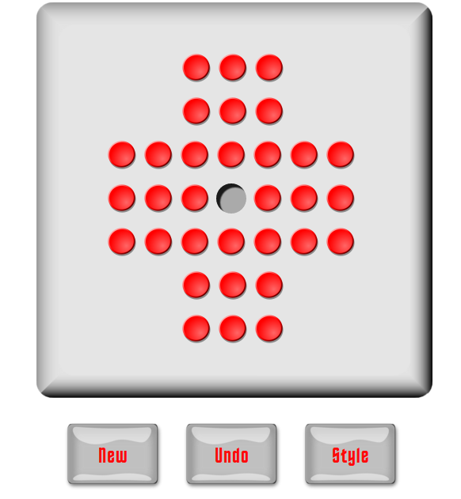
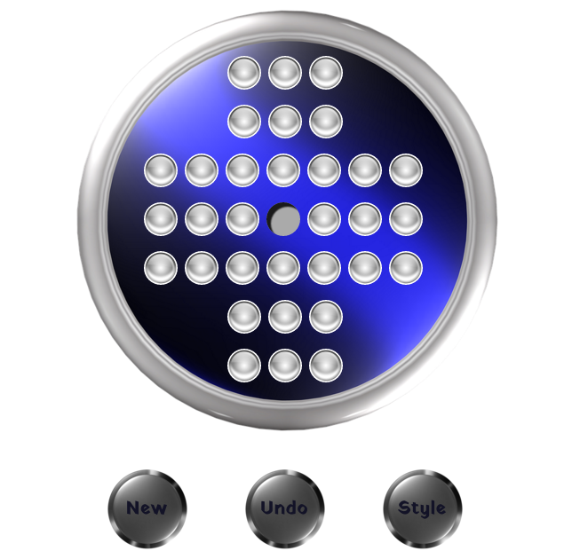

#Peg Solitaire

</img>

My peg solitaire game is written in vanilla JavaScript, and uses the HTML5 drag and drop API.  It includes buttons for undoing the last move and for resetting the gameboard, as well as for changing the entire display:

</img>

To play peg solitaire, click <a href="https://adrianaalter.github.io/PegSolitaire/">here</a>!
